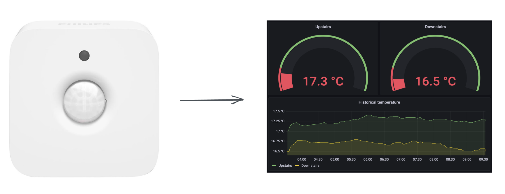

# Hue temperature logger



**🌡 Log temperature with Hue Sensors**

**☁️ Save data to Google Sheets**


Log temperature from your Philips Hue Motion Sensors (which also log temperature) and save it to Google Sheets to visualize. This code only does the logging part, intended to be run on a server or a Raspberry Pi sitting in your home, pushing data to Google Sheets.


## Setup
Here's what you'll need in order to get this up and running:
- Philips Hue Motion Sensor
- The IP of your Philips Hue Bridge
- Google Sheets URL
- Google  `service_account.json` file

Install dependencies:
```
# Install dependencies
git clone git@github.com:sasha42/Hue-Temperature-Logger.git
cd Hue-Temperature-Logger/
python3 -m venv venv
source venv/bin/activate
pip install -r requirements.txt
```

Edit logger.service with your own values:
```
Environment="PHILIPS_HUE_IP=192.168.1.xxx"
Environment="SHEET_URL=https://docs.google.com/spreadsheets/d/your_sheet_id_here/edit#gid=0"
Update any paths to the correct location
```

Copy service file to systemd:
```
sudo cp *.service /etc/systemd/system/.
sudo systemctl enable logger.service
sudo systemctl start logger.service
```

That's it! This should send data to your Google Sheet every 5 minutes.

If something doesn't work, you can try the following commands to debug:

```
##### Debug
sudo systemctl status logger.service
sudo systemctl -q daemon-reload
journalctl -u logger.service
cat temperature_logger.log
```

---

Made with ♥️ in Switzerland